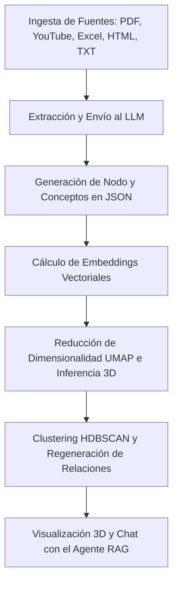

# PragmaForge (llm-wiki-local) - Documentación y Explicación del Proyecto

Este documento proporciona una explicación exhaustiva y en profundidad del proyecto **PragmaForge** (también conocido como `llm-wiki-local`), detallando sus objetivos, arquitectura de software, flujo de datos, componentes principales y funcionamiento interno.

---

## 1. Resumen del Proyecto

**PragmaForge** es una plataforma local e interactiva de gestión del conocimiento y visualización de datos semánticos en 3D. Permite a los usuarios ingerir documentos e información de múltiples orígenes, transformarlos automáticamente en un grafo conceptual mediante Inteligencia Artificial (LLMs) y explorar relaciones complejas entre ellos a través de una interfaz interactiva tridimensional.

### ¿De qué trata?
El sistema extrae la esencia temática de archivos PDF, planillas de Excel, páginas HTML, archivos de texto y videos de YouTube. Luego, posiciona cada documento en un espacio virtual 3D basándose en su contenido semántico y agrupa los temas relacionados mediante algoritmos avanzados de reducción de dimensionalidad y agrupamiento (*clustering*). Finalmente, ofrece un agente inteligente con capacidades de **Generación Recuperada por Búsqueda (RAG)** para chatear sobre el conocimiento acumulado, resolver problemas mediante el cruce de información (*issues*) y generar reportes automatizados de conexiones.

---

## 2. Flujo de Trabajo e Ingesta de Datos (Data Pipeline)

El flujo de procesamiento de un documento en PragmaForge consta de cinco etapas consecutivas:



### 1. Ingesta y Extracción de Texto
Dependiendo del tipo de entrada, [processor.py](file:///c:/Users/brusa/llm-wiki-local/processor.py) aplica diferentes estrategias de extracción:
*   **PDFs:** Extrae el texto utilizando PyMuPDF (`fitz`). Si el proveedor de LLM configurado es Anthropic (Claude), realiza una ingesta de PDF nativa pasando el archivo directamente codificado en Base64.
*   **YouTube:** Consulta la API *oEmbed* para recuperar metadatos enriquecidos (título real y autor) sin necesidad de credenciales (API Key) de Google, construyendo un resumen deductivo y asociándolo a la miniatura del video.
*   **Excel:** Lee y compila las primeras 20 filas de la hoja de cálculo utilizando `openpyxl`.
*   **HTML y URLs Web:** Descarga el contenido mediante peticiones HTTP asíncronas (`httpx`), analiza y limpia el marcado HTML con BeautifulSoup (`bs4`), aislando el texto legible.
*   **Text/Markdown:** Lee los archivos planos directamente.

### 2. Procesamiento y Estructuración Temática con LLM
El texto extraído se introduce a un prompt altamente restrictivo que obliga al LLM (Claude, Gemini o un modelo local en Ollama) a responder **únicamente con un esquema JSON estructurado** que contiene:
*   `id`: Identificador único.
*   `label`: Título del documento.
*   `desc`: Una descripción conceptual estructurada de 4 a 5 oraciones en español.
*   `fragmento`: Una cita textual o idea central de 20 a 50 palabras.
*   `conceptos`: Entre 8 y 14 palabras clave o conceptos representativos del texto.

### 3. Generación de Embeddings
El sistema concatena el título, descripción, fragmento y conceptos del nodo generado y utiliza la biblioteca `sentence-transformers` con el modelo pre-entrenado **`all-mpnet-base-v2`** (~440MB) para generar un vector semántico denso de 768 dimensiones.

### 4. Proyección en el Espacio 3D (UMAP)
Dado que los humanos no pueden visualizar un vector de 768 dimensiones, [embeddings_engine.py](file:///c:/Users/brusa/llm-wiki-local/embeddings_engine.py) utiliza **UMAP (Uniform Manifold Approximation and Projection)** para proyectar de manera óptima las 768 dimensiones a un espacio de 3 componentes cartesianas (`x3d`, `y3d`, `z3d`).
*   **Alineación Incremental:** Para evitar que la redibujación del grafo desplace los nodos existentes cada vez que se agrega información, el modelo UMAP se entrena inicialmente y se serializa en `umap_model.pkl`. En las ingestas posteriores, los nuevos embeddings se proyectan (`transform`) utilizando el modelo ya cargado.

### 5. Agrupamiento Semántico (HDBSCAN) y Enlaces
*   **Clustering (HDBSCAN):** Ejecuta agrupamiento jerárquico basado en densidad sobre las coordenadas 3D para definir a qué clúster temático pertenece cada nodo. Los nodos en el mismo grupo reciben un número de clúster que se traduce en un color unificado en el frontend.
*   **Regeneración de Relaciones:** El sistema calcula de manera dinámica los enlaces del grafo conectando nodos que cumplan al menos una de estas condiciones:
    1.  **Similitud de Coseno:** Tienen una similitud semántica en sus embeddings vectoriales mayor o igual a **`0.38`**.
    2.  **Coincidencia de Conceptos:** Comparten al menos **dos conceptos clave** (ya sea coincidencia exacta o por subcadenas).

---

## 3. Arquitectura del Software y Componentes

La aplicación está dividida en un servidor backend en Python y una interfaz frontend en React.

### 3.1. Backend (Python / FastAPI)

Es el núcleo del procesamiento matemático y de IA. Se define y arranca en:
*   [main.py](file:///c:/Users/brusa/llm-wiki-local/main.py): Levanta el servidor FastAPI en el puerto `8000`. Define las rutas API principales y orquesta las tareas en segundo plano (`BackgroundTasks`) para que el proceso de ingesta y generación de embeddings no bloquee la interfaz web.
*   [processor.py](file:///c:/Users/brusa/llm-wiki-local/processor.py): Contiene las rutinas de scraping, parsing, comunicación con los modelos de IA y funciones matemáticas como la similitud del coseno.
*   [embeddings_engine.py](file:///c:/Users/brusa/llm-wiki-local/embeddings_engine.py): Ejecuta los procesos matemáticos de UMAP y HDBSCAN para dar forma al espacio 3D.
*   [server.py](file:///c:/Users/brusa/llm-wiki-local/server.py): Representa una alternativa liviana basada en `http.server` de Python para desarrollos rápidos o servidores estáticos simplificados sin dependencias de FastAPI.

#### Rutas del API del Backend:
*   `GET /api/graph`: Retorna la colección completa de nodos (`nodos_generated.json`) con sus coordenadas 3D calculadas.
*   `POST /api/ingest`: Recibe archivos físicos o URLs web y arranca el pipeline de ingesta asíncrono.
*   `POST /api/issue`: Procesa descripciones de problemas ingresadas por el usuario, localiza nodos relevantes y sintetiza planes de resolución.
*   `GET /api/node/{node_id}/report`: Genera un reporte dinámico en formato Markdown para descarga directa con las conexiones de un nodo.
*   `POST /api/recompute-relations`: Permite recalcular de forma manual todas las relaciones y similitudes del grafo.
*   `DELETE /api/node/{node_id}`: Remueve un nodo y actualiza los enlaces.

---

### 3.2. Frontend (React 18 + Vite)

El frontend reside en el directorio [frontend](file:///c:/Users/brusa/llm-wiki-local/frontend). Utiliza Vite como servidor de desarrollo y empaquetador, y Vanilla CSS estructurado en [App.css](file:///c:/Users/brusa/llm-wiki-local/frontend/src/App.css) para lograr una estética oscura de estilo "futurista/glassmorphism".

#### Componentes Principales:
1.  **[App.jsx](file:///c:/Users/brusa/llm-wiki-local/frontend/src/App.jsx):** Es el orquestador principal del estado (nodos seleccionados, búsquedas, activación de paneles y llamadas a la API del servidor).
2.  **[Graph3D.jsx](file:///c:/Users/brusa/llm-wiki-local/frontend/src/components/Graph3D.jsx):** Renderiza la visualización 3D usando `react-force-graph-3d` (impulsado por `Three.js`).
    *   **Sprites Personalizados:** Cada nodo se dibuja en un Canvas 2D interactivo convertido en textura 3D. Muestra las iniciales del concepto, el título y, si es posible, una vista previa en tiempo real (por ejemplo, la primera página del PDF extraída por el backend o la miniatura de YouTube). Los nodos de tipo "Issue" se destacan con un icono de advertencia rojo (`⚠`).
    *   **Fuerza de Clúster Personalizada:** Implementa una fuerza de simulación física que atrae ligeramente a los nodos pertenecientes al mismo grupo HDBSCAN hacia su baricentro/centroide común, logrando agrupaciones visuales claras.
3.  **[NodePanel.jsx](file:///c:/Users/brusa/llm-wiki-local/frontend/src/components/NodePanel.jsx):** Panel lateral flotante que se activa al hacer clic en un nodo. Muestra el resumen del LLM, fragmentos textuales, conceptos y enlaces a documentos originales. Permite abrir el agente para consultar puntualmente sobre este nodo.
4.  **[AgentPanel.jsx](file:///c:/Users/brusa/llm-wiki-local/frontend/src/components/AgentPanel.jsx):** Chat conversacional con el agente de IA. Cuenta con dos modalidades:
    *   *Modo Local/Nodo:* Conversación contextualizada en la información del nodo seleccionado.
    *   *Modo Global:* Realiza búsquedas semánticas (vectoriales) a partir de lo que escribe el usuario para alimentar el prompt del agente con los 5 documentos más relevantes del grafo (RAG).
5.  **[IssuePanel.jsx](file:///c:/Users/brusa/llm-wiki-local/frontend/src/components/IssuePanel.jsx):** El módulo de resolución de problemas. Permite al usuario plantear un problema o bug, adjuntar un documento (PDF, HTML, TXT) o una URL, mapearlo como un nodo de conflicto en el grafo y recibir un análisis profundo del LLM estructurado en base a las herramientas conceptuales y técnicas de los nodos semánticamente conectados.
6.  **[RelationPanel.jsx](file:///c:/Users/brusa/llm-wiki-local/frontend/src/components/RelationPanel.jsx):** Se abre al hacer clic en un enlace físico del grafo. Muestra por qué están conectados los dos nodos (similitud matemática exacta e intersección de conceptos compartidos) y permite gatillar un análisis profundo de complementariedad con el LLM.
7.  **[SynthesisPanel.jsx](file:///c:/Users/brusa/llm-wiki-local/frontend/src/components/SynthesisPanel.jsx):** Habilita la selección de múltiples nodos de forma libre para exigirle al LLM un análisis consolidado o una síntesis integrativa.
8.  **[LibraryPanel.jsx](file:///c:/Users/brusa/llm-wiki-local/frontend/src/components/LibraryPanel.jsx):** Vista tabular y de catálogo clásico para buscar, filtrar y eliminar nodos de forma directa.

---

## 4. Instalación y Configuración del Entorno

### 4.1. Requisitos Previos
*   Python 3.10 o superior.
*   Node.js (versión 18 o superior) y npm.

### 4.2. Configuración de Variables de Entorno
Crea o edita el archivo `.env` en la raíz del proyecto para definir los accesos a los modelos:

```env
# Proveedor de LLM: 'anthropic', 'gemini' o 'ollama'
LLM_PROVIDER=anthropic

# Modelo a utilizar
LLM_MODEL=claude-3-5-sonnet-latest

# Claves de API requeridas según el proveedor
ANTHROPIC_API_KEY=tu_api_key_aquí
GEMINI_API_KEY=tu_api_key_aquí

# Para Ollama (en caso de usar modelos locales)
OLLAMA_URL=http://localhost:11434/v1/chat/completions
```

### 4.3. Servidor Backend (FastAPI)
1. Instala las dependencias de Python:
   ```bash
   pip install -r requirements-fastapi.txt
   ```
2. Ejecuta el backend en modo desarrollo:
   ```bash
   python main.py
   ```
   El servidor estará disponible en `http://localhost:8000`.

### 4.4. Frontend (Vite)
1. Navega al directorio del frontend:
   ```bash
   cd frontend
   ```
2. Instala los paquetes de Node:
   ```bash
   npm install
   ```
3. Inicia el servidor de desarrollo del frontend:
   ```bash
   npm run dev
   ```
4. Para compilar y servir en producción desde FastAPI, ejecuta:
   ```bash
   npm run build
   ```
   Vite generará los archivos en `frontend/dist` y `main.py` los servirá automáticamente en la ruta raíz `/`.

---

## 5. Resumen de Tecnologías Empleadas

| Capa | Tecnología | Propósito |
| :--- | :--- | :--- |
| **Backend Framework** | FastAPI / Uvicorn | APIs rápidas y servicio de archivos estáticos. |
| **Inteligencia Artificial** | Anthropic API / Gemini API / Ollama | Extracción semántica, síntesis y respuestas conversacionales. |
| **Indexación Vectorial** | Sentence Transformers (`all-mpnet-base-v2`) | Generación de embeddings densos de 768d. |
| **Visualización Geométrica** | UMAP | Reducción no lineal de 768d a coordenadas 3D cartesianas. |
| **Agrupamiento Conceptual**| HDBSCAN | Clustering no supervisado basado en densidad en espacio 3D. |
| **Visualización 3D** | React Force Graph 3D / Three.js / WebGL | Renderizado acelerado por GPU de grafos de nodos interactivos. |
| **Lector de PDFs** | PyMuPDF (`fitz`) | Extracción de texto y renderizado de miniaturas de portadas. |
| **Planillas** | openpyxl | Parsing y vista previa de archivos Excel. |

---

Este proyecto combina técnicas de **Procesamiento de Lenguaje Natural (NLP)**, **Matemáticas Vectoriales** y **Desarrollo Web 3D** para crear una herramienta intuitiva de exploración e investigación de grandes volúmenes de documentos, facilitando enormemente el aprendizaje guiado y la resolución sistémica de problemas técnicos.
